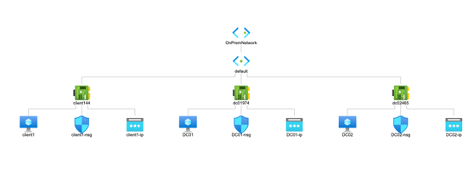

# Active Directory Lab
> Goal: Set up a home lab- AD lab in Azure using DNS setting

> Project layout \
> VNet -> DC01/DC02 -> Active Directory -> Client Ready

### 1. Creating a server machines using MS server 2019 on Azure
> Double check the RDP option is enabled, we are going to use the protocol to log into the machines.

### 2. Adding the server to a new forest and intalling active directory onto the server and promote the server to a domain controller

### 3. Sync two domain controllers with each other.

### 4. Adding users using powershell script

### 5. Creating a client machine and test the successful setup.

> Using xfreerdp [xfreerdp](https://www.freerdp.com/) to log into vm.

client ready on both server
> 